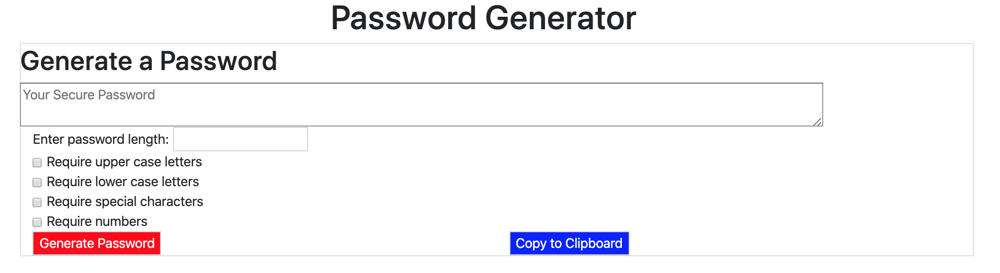
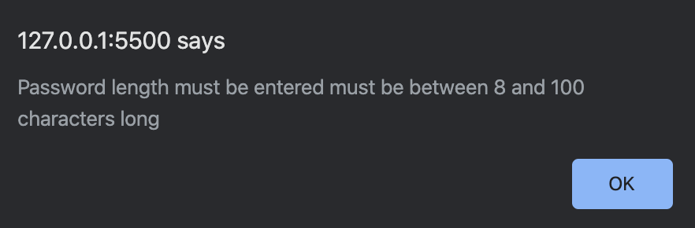
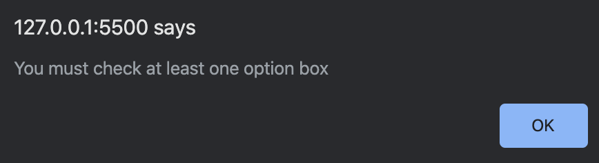
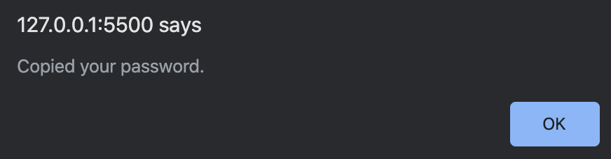

# Password Generator

This site will help generate a password using requirements put in by the user.
The user must put in a password length between 8 and 100 characters, and must select at least one of the character sets provided.
### This is a link to the website

https://seanianking.github.io/lifewtrgenerator/index.html

## Contents

Below is a picture of the main page:

To generate a password you must fill in the length you want the password to be, and select at least one of the check boxes for a character set. If you do not you will receive one of the following messages:

After creating the password you can copy it directly to the clipboard by clicking the associated button. When you do so you will get the following alert:

